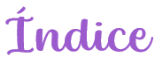
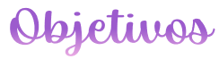
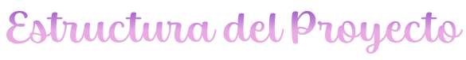
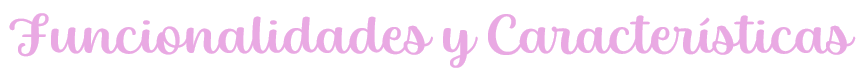
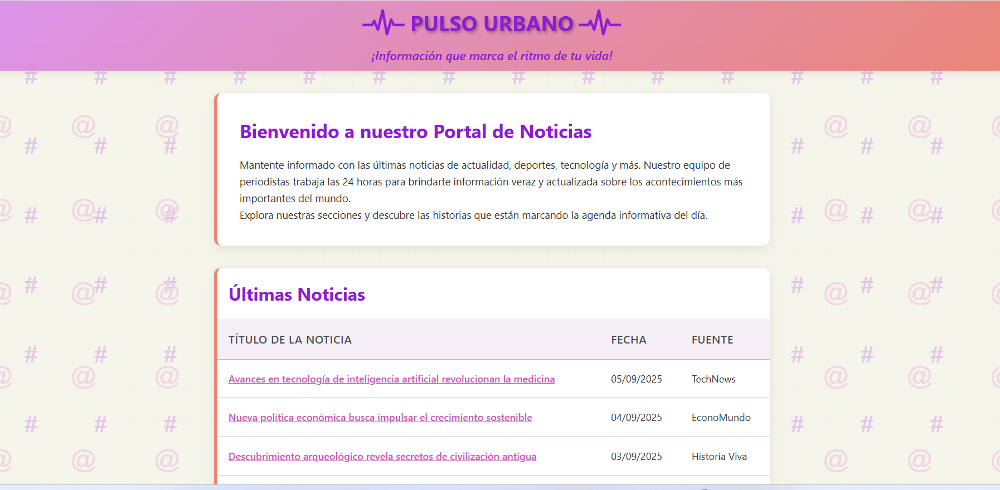
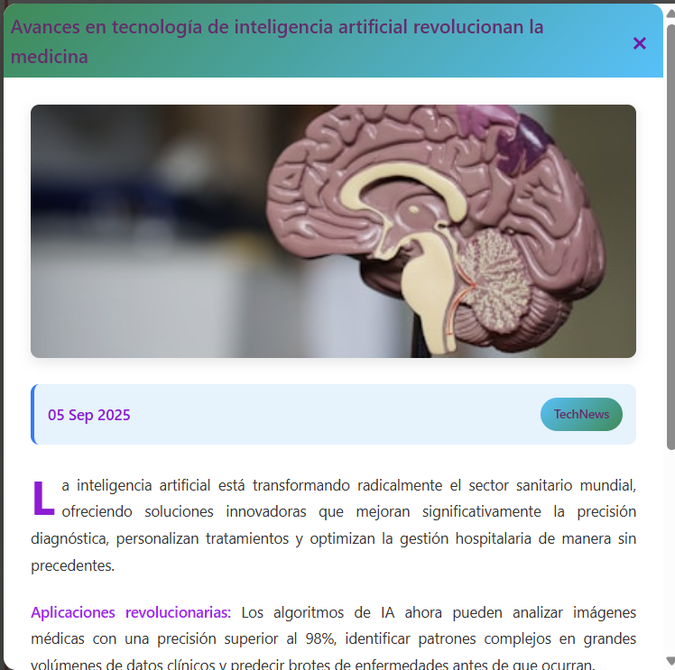
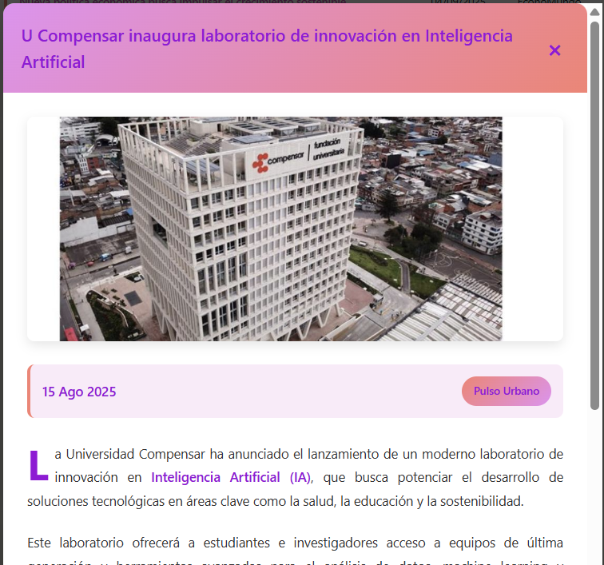
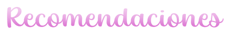

<p align="center">
       
</p>

<p align="center">
  
</p>

---

<a id="índice"></a>
<p align="left">
  
</p>

1. [Descripción del Trabajo](#descripción-del-trabajo)  
2. [Objetivos](#objetivos)  
3. [Tecnologías Usadas](#tecnologías-usadas)  
4. [Requisitos Técnicos](#requisitos-técnicos)  
5. [Estructura del Proyecto](#estructura-del-proyecto)       
6. [Funcionalidades y Características](#funcionalidades-y-características)  
7. [Resultado Final](#resultado-final)  
8. [Recomendaciones](#recomendaciones)  
9. [Conclusiones](#conclusiones)  
10. [Desarrolladora](#desarrolladora)  

---

<a id="descripción-del-trabajo"></a>
<p align="left">
  
</p>

Pulso Urbano es un **portal web de noticias** desarrollado como proyecto académico para la asignatura *Introducción a los Lenguajes de Internet*.  
El sitio implementa **HTML, CSS y JavaScript** para crear una plataforma visualmente atractiva y funcional, donde se muestran noticias a través de una **tabla interactiva**, **tarjetas destacadas (cards)** y un **modal dinámico** que despliega la información completa de cada noticia.  

El proyecto cumple con los **requisitos de estructura semántica en HTML**, la aplicación de **estilos personalizados en CSS** (uso de *flex*, *grid*, tipografías y combinaciones de color) y la **interactividad mediante JavaScript**.  

Además, integra secciones esenciales como:  
- **Encabezado con título y slogan**  
- **Menú de navegación con enlaces a redes sociales**  
- **Introducción al portal**  
- **Tabla de últimas noticias**  
- **Noticias destacadas con cards**  
- **Modal para ampliar la información**  
- **Pie de página con enlaces y derechos de autor ficticios**  

Este trabajo busca reforzar conocimientos en **estructuración web, diseño responsivo y usabilidad**, ofreciendo una experiencia cercana a un portal de noticias real.

<p align="right">
  <a href="#índice">⬆️ Volver al índice</a>
</p>

---

<a id="objetivos"></a>
<p align="left">
  
</p>

###  Objetivo General  
Desarrollar un **portal web de noticias** que permita aplicar los conocimientos adquiridos en HTML, CSS y JavaScript, integrando estructura, diseño e interactividad para simular la experiencia de un sitio informativo real y funcional.  

###  Objetivos Específicos  
- Implementar una **estructura semántica en HTML** que organice adecuadamente los diferentes apartados de la página.  
- Aplicar **estilos personalizados en CSS** utilizando técnicas modernas como *flexbox* y *grid* para lograr un diseño atractivo y responsivo.  
- Incorporar **funcionalidad con JavaScript** mediante el uso de modales y enlaces interactivos que mejoren la experiencia del usuario.  

<p align="right">
  <a href="#índice">⬆️ Volver al índice</a>
</p>

---

<a id="tecnologías-usadas"></a>
<p align="left">
  
</p>

Este proyecto fue desarrollado utilizando las siguientes tecnologías:

-  **HTML5** → Lenguaje de marcado empleado para la estructura semántica del portal de noticias.  
-  **CSS3** → Estilos personalizados aplicados para el diseño visual, uso de *flexbox*, *grid* y diseño responsivo.  
-  **JavaScript** → Lógica e interactividad, incluyendo el manejo de modales dinámicos y la visualización de noticias.  
-  **Font Awesome** → Biblioteca de íconos utilizada para enriquecer la presentación de enlaces y secciones.  

<p align="right">
  <a href="#índice">⬆️ Volver al índice</a>
</p>
 
---

<a id="requisitos-técnicos"></a>
<p align="left">
  
</p>

Para ejecutar este proyecto correctamente se requieren los siguientes elementos:

- 🖥️ **Navegador web moderno** (Google Chrome, Mozilla Firefox, Edge, etc.) compatible con HTML5, CSS y JavaScript.  
- 📂 **Clonar o descargar el repositorio** para acceder a los archivos del proyecto.  
- ⚡ **Conexión a internet** (opcional, solo necesaria para cargar íconos externos de Font Awesome desde CDN).  
- 📝 **Editor de código** (Visual Studio Code, Sublime Text, etc.) recomendado para modificaciones.  

<p align="right">
  <a href="#índice">⬆️ Volver al índice</a>
</p>

---

<a id="estructura-del-proyecto"></a>
<p align="left">
  
</p>

La estructura del proyecto se organiza de la siguiente manera:

```
PulsoUrbano/
│── index.html        # Archivo principal con la estructura HTML del portal
│── style.css         # Archivo de estilos CSS para diseño y responsividad
│── script.js         # Archivo JavaScript para la interactividad (modales, noticias)
│
├── img/              # Carpeta con imágenes utilizadas en la página
│
├── readme-img/       # Carpeta con imágenes utilizadas en el README
│ 
└── README.md         # Documentación del proyecto
```

###  Descripción de los archivos principales
- **index.html** → Contiene la estructura semántica del portal de noticias, incluyendo el encabezado, menú de navegación, tabla, cards, modal y pie de página.  
- **style.css** → Define los estilos visuales del sitio: colores, tipografías, layout con *flexbox* y *grid*, diseño responsivo y efectos hover.  
- **script.js** → Añade la lógica de interactividad, como la apertura y cierre de noticias en modales dinámicos.  
- **img/** → Almacena los recursos gráficos que aparecen dentro de la página.  
- **readme-img/** → Contiene las imágenes utilizadas en la documentación del proyecto (README).  

###  Esquema simplificado de `index.html`
```
<header> 
└── Logo + Título + Slogan 
<nav> 
└── Enlaces a redes sociales 
<main> 
├── Sección Introducción 
├── Tabla de Últimas Noticias 
├── Cards de Noticias Destacadas 
└── Modal para ver noticias completas 
<footer> 
└── Información ficticia + Redes sociales + Derechos de autor
```

<p align="right">
  <a href="#índice">⬆️ Volver al índice</a>
</p>

---

<a id="funcionalidades-y-características"></a>
<p align="left">
  
</p>

El portal **Pulso Urbano** incluye las siguientes funcionalidades y características principales:

-  **Encabezado y slogan** → Presenta el logo, título y frase distintiva del sitio.  
-  **Menú de navegación** → Enlaces a redes sociales con íconos interactivos.  
-  **Sección de introducción** → Breve bienvenida al portal de noticias.  
-  **Tabla de últimas noticias** → Muestra títulos, fechas y fuentes con enlaces interactivos.  
-  **Cards de noticias destacadas** → Tarjetas visuales con imágenes, descripciones y meta-información.  
-  **Modal dinámico** → Permite visualizar la noticia completa al hacer clic en la tabla o las cards.  
-  **Diseño responsivo** → Adaptado para dispositivos móviles, tablets y pantallas de escritorio.  
-  **Efectos visuales** → Animaciones hover, gradientes y sombreado para mejorar la experiencia del usuario.  

###  Tecnologías y sus aportes

| Tecnología | Funcionalidades principales |
|------------|-----------------------------|
|  **HTML5** | Estructura semántica del sitio (header, nav, main, footer), tabla de noticias, cards y modal. |
|  **CSS3** | Estilos personalizados, paleta de colores, tipografías, uso de *flexbox* y *grid*, diseño responsivo y efectos hover. |
|  **JavaScript** | Lógica para abrir/cerrar modales, mostrar noticias completas y mejorar la interactividad. |

<p align="right">
  <a href="#índice">⬆️ Volver al índice</a>
</p>

---

<a id="resultado-final"></a>
<p align="left">
  
</p>

El portal **Pulso Urbano** se desarrolló con un diseño atractivo, responsivo e interactivo, cumpliendo con todos los requisitos del proyecto académico.  
En él se puede apreciar la estructura semántica, la integración de estilos personalizados y la interactividad con JavaScript mediante el uso de modales.  

<p align="center">
  
  <br>
  <strong>Página principal</strong>
</p>

<table align="center">
  <tr>
    <td align="center" width="50%">
      <br>
      <strong>Modal de noticia 1</strong>
    </td>
    <td align="center" width="50%">
      <br>
      <strong>Modal de noticia 2</strong>
    </td>
  </tr>
</table>

<p align="right">
  <a href="#índice">⬆️ Volver al índice</a>
</p>

---

<a id="recomendaciones"></a>
<p align="left">
  
</p>

Para mejorar y ampliar este proyecto se proponen las siguientes recomendaciones:

-  **Optimizar el código** separando aún más los estilos y scripts para facilitar el mantenimiento.  
-  **Ampliar la responsividad** probando en diferentes dispositivos y resoluciones de pantalla.  
-  **Agregar más secciones de noticias** (ejemplo: deportes, tecnología, entretenimiento) para simular un portal más completo.  
-  **Integrar consumo de API externas** de noticias para mostrar información en tiempo real.  
-  **Mejorar la accesibilidad** aplicando buenas prácticas en contraste de colores, etiquetas ARIA y tamaños de fuente.  
-  **Optimizar carga de imágenes** utilizando formatos comprimidos y adaptativos (WebP o AVIF).  

<p align="right">
  <a href="#índice">⬆️ Volver al índice</a>
</p>

---

<a id="conclusiones"></a>
<p align="left">
  
</p>

El desarrollo del portal **Pulso Urbano** permitió aplicar de manera integral los conocimientos adquiridos en **HTML, CSS y JavaScript**, logrando un producto web con estructura clara, diseño atractivo e interactividad funcional.  

Este proyecto demostró la importancia de la **organización semántica en HTML**, el uso de **estilos personalizados en CSS** para mejorar la experiencia visual y la aplicación de **JavaScript** como herramienta clave para dotar al sitio de dinamismo.  

Además, la práctica fomentó el fortalecimiento de competencias en **usabilidad, diseño responsivo y accesibilidad**, habilidades esenciales para el desarrollo web moderno.  

En conclusión, **Pulso Urbano** no solo cumple con los objetivos académicos planteados, sino que también representa una base sólida para la creación de proyectos más complejos, incorporando nuevas tecnologías y funcionalidades que simulen cada vez más un portal de noticias real.  

<p align="right">
  <a href="#índice">⬆️ Volver al índice</a>
</p>

---

<a id="desarrolladora"></a>
<p align="left">
  
</p>

<div align="center">
  
  <br>
  <strong>Johana Jazmín Saavedra</strong>
</div>

<p align="justify">
El proyecto fue creado por <strong>Johana Jazmín Saavedra</strong>, estudiante de cuarto semestre de la <strong>Técnica Profesional en Programación de Aplicaciones de Software</strong> en la <strong>Fundación Universitaria Compensar</strong>.  
Durante su desarrollo, Johana participó de manera activa en todas las fases del trabajo, aportando creatividad, dedicación y compromiso para lograr un portal web funcional y visualmente atractivo.  
</p>

<p align="right">
  <a href="#índice">⬆️ Volver al índice</a>
</p>

---


